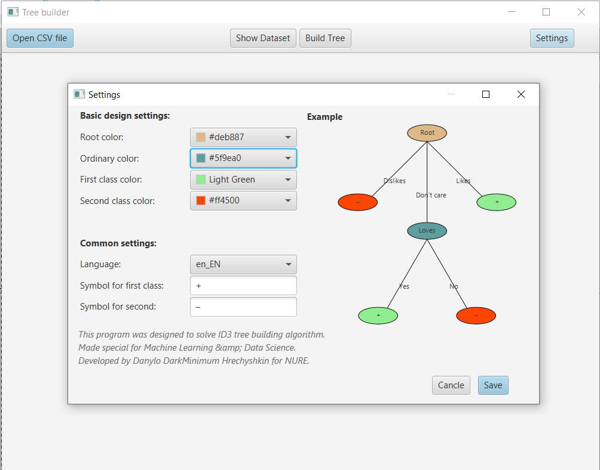

# ID3-tree-builder-Java

This algorithm allows you to build desicion tree from .csv datasets. \
*For russian localization you have to change String lang in HelloApplication to "ru_RU"*

Main window:

Settings window( allows you to mange the colors of the system and so aditional data):

To build a tree you have to use .csv files with same structure:

Then you can simply show the desicion tree by clicking the Build Tree:

TODO:
- there are some issues with list of attributes to recalculate gain
- dynamic language changing in settings window
- testing algorithm on other datasets ???

